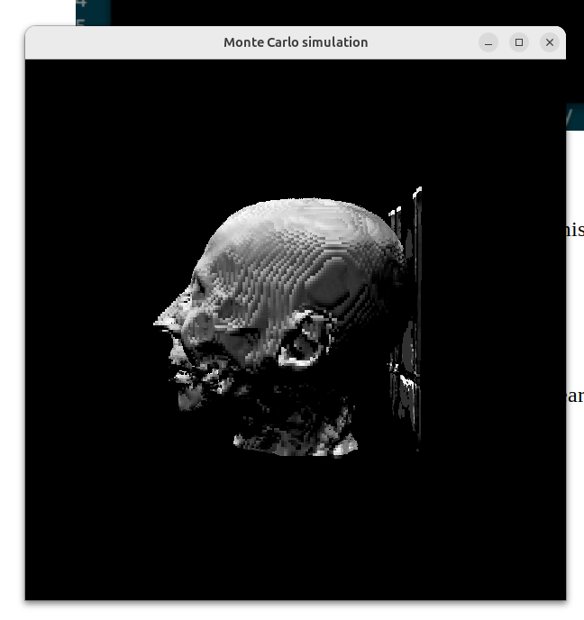
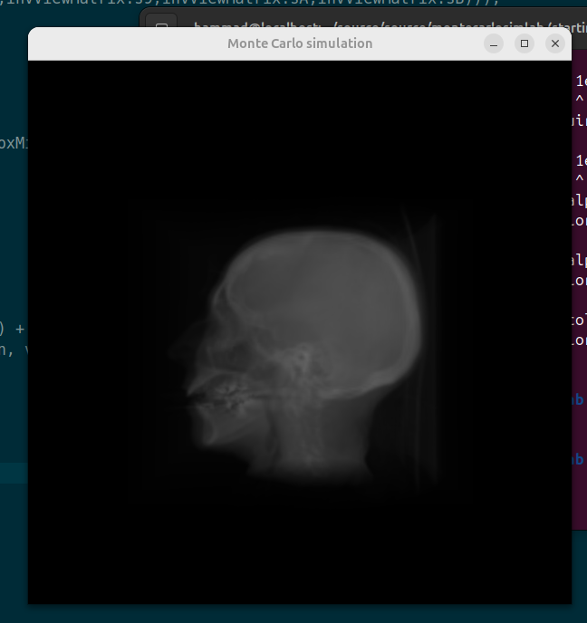
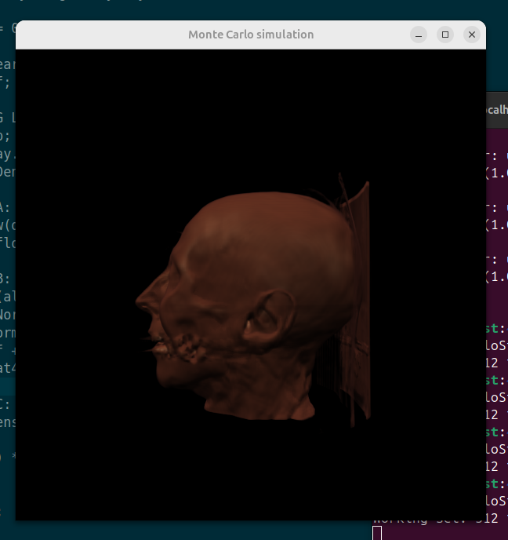
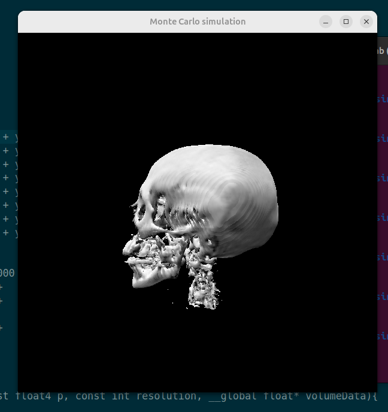
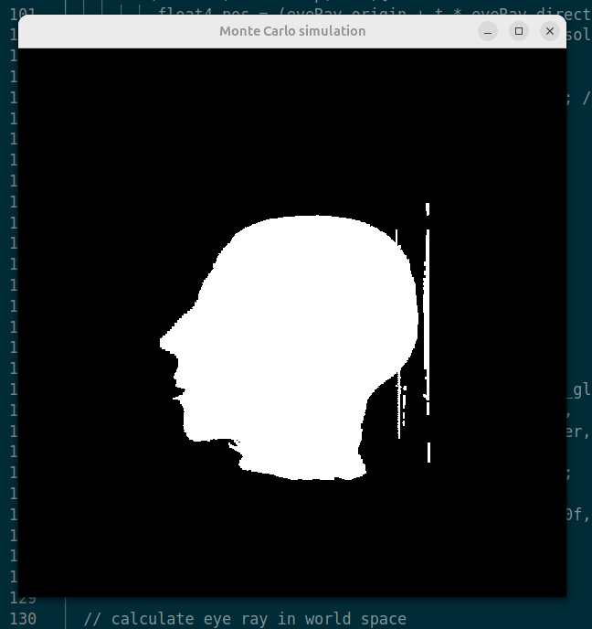

# 🧠 OpenCL Volume Renderer

A high-performance 3D volume renderer built with **OpenCL**, **C++**, and **OpenGL**. This project simulates isosurfaces and volume shading using Monte Carlo techniques, leveraging GPU acceleration for real-time rendering of volumetric datasets.

<p align="center">
  
</p>

---

## 🚀 Features

- ⚡ GPU-accelerated volume rendering using OpenCL
- 🎥 Interactive camera controls for 3D navigation
- 🧪 Monte Carlo-based isosurface estimation
- 🖼️ Support for transfer functions and multiple shading techniques
- 🔧 Modular kernel and rendering pipeline

---

## 📁 Project Structure

```├── bin
│   └── freeglut.dll
├── external
│   └── freeglut
│       ├── Copying.txt
│       ├── include
│       │   └── GL
│       │       ├── freeglut_ext.h
│       │       ├── freeglut.h
│       │       ├── freeglut_std.h
│       │       └── glut.h
│       ├── lib
│       │   └── freeglut.lib
│       └── Readme.txt
├── kernels
│   ├── programs.cl
│   └── visualization.cl
├── MonteCarloSim
│   ├── camera.cpp
│   ├── camera.hpp
│   ├── camera.o
│   ├── cl.hpp
│   ├── Common.h
│   ├── Makefile
│   ├── matrix4x4.cpp
│   ├── matrix4x4.hpp
│   ├── matrix4x4.o
│   ├── MonteCarloSimApp
│   ├── MonteCarloSim.cpp
│   ├── MonteCarloSim.o
│   ├── MonteCarloSim.vcxproj
│   ├── MonteCarloSim.vcxproj.filters
│   └── vector.hpp
├── MonteCarloSim.sln
├── screenshots
│   ├── linearly_interpolated_isosurface.png
│   ├── shaded_isosurface1.png
│   ├── shaded_isosurface.png
│   ├── shading.png
│   ├── transfer_function.png
│   ├── white_color_isosurface1.png
│   ├── white_color_isosurface.png
│   └── x-ray_rendering.png
└── volumes
    └── head.vox
```

## 🛠️ Build & Run

### 💻 On Ubuntu (VS Code)

1. **Install Required Dependencies**

   Run the following commands to install the necessary packages:

   ```bash
   sudo apt update
   sudo apt install build-essential freeglut3-dev libglew-dev ocl-icd-opencl-dev

2. **Open the Project in VS Code**
   
   code .
3. **Build the Project**
   
   cd MonteCarloSim
   make
   
4. **Run the Application**
   
   ./MonteCarloSimApp


## 📸 Screenshots

<p align="center">  <br/> <em>Shaded Isosurface with Volume Lighting</em> </p> <p align="center">  <br/> <em>X-Ray Style Volume Rendering</em> </p> <p align="center">  <br/> <em>Rendering with Custom Transfer Function</em> </p> <p align="center">  <br/> <em>Linearly Interpolated Isosurface</em> </p> <p align="center">  <br/> <em>White Isosurface with Soft Shading</em> </p>
